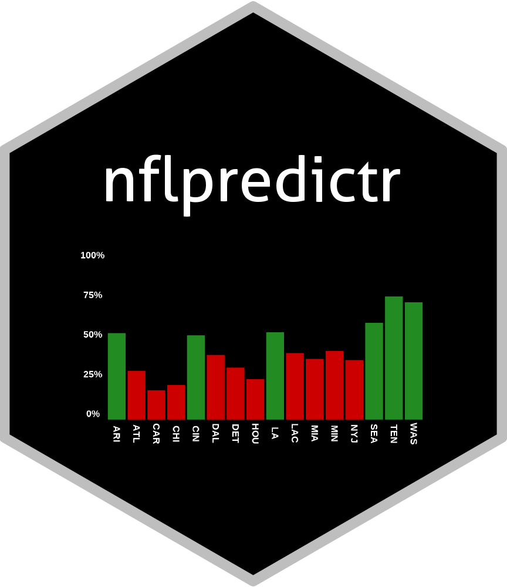
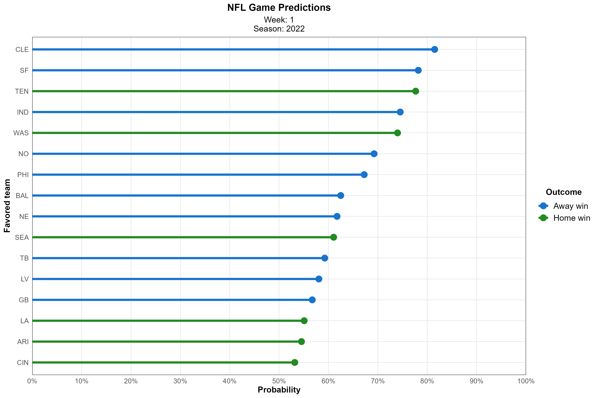

<!-- README.md is generated from README.Rmd. Please edit that file -->

```{r, include = FALSE}
knitr::opts_chunk$set(
  collapse    = TRUE,
  comment     = "#>",
  fig.path    = "man/figures/README-",
  out.width   = "40%",
  eval        = TRUE
)
# The `nflpredictr` R package provides a lightweight R package that provides predictions for upcoming (and past) NFL games. 
# `nflpredictr` provides four main things:
# 
#   1. Retrieves new data to use an inputs into a [ML model trained to predict the outcomes of NFL games](https://anguswg-ucsb.github.io/nfl_wins/)
#   2. Generate predictions using the new data
#   3. Visualize results.
#   4. Retrieve Las Vegas Odds and lines to compare with the predictions generated from `nflpredictr`
```

# nflpredictr 

<!-- badges: start -->
[](#)
[](https://choosealicense.com/licenses/mit/)
<!-- badges: end -->

<div align="left">

  <p align="left">
    <a href="http://68.183.25.9:8000/__docs__/"><strong>« API »</strong></a>
    <br />
    <a href="https://anguswg-ucsb.github.io/nfl_wins/">Model Details</a>
  </p>
</div>

<hr>

The `nflpredictr` R package provides a lightweight R package that provides predictions for upcoming (and past) NFL games. 
`nflpredictr` provides four main things:

  1. Retrieves new data to use an inputs into a [ML model trained to predict the outcomes of NFL games](https://anguswg-ucsb.github.io/nfl_wins/)
  2. Generate predictions using the new data
  3. Visualize results.
  4. Retrieve Las Vegas Odds and lines to compare with the predictions generated from `nflpredictr`


<hr>

## Installation

You can install the development version of `nflpredictr` from [GitHub](https://github.com/) with:

```{r, eval=FALSE, echo=TRUE}
# install.packages("devtools")
devtools::install_github("anguswg-ucsb/nflpredictr")
```

## Example

`nflpredictr` provides utility functions for accessing game predictions from a Logistic Regression ML model that was trained on ~20 years of historic NFL data and [correctly predicts the outcomes of games ~69% of the time](https://anguswg-ucsb.github.io/nfl_wins/#Model_Performance_on_Test_Data).
If no inputs are given to `predict_games()`, the default behavior is to make a prediction for the upcoming week of the current NFL season
```{r example}
# Load package
# library(nflpredictr)

# Make an API request using predict_games()
# nflpredictr::predict_games(
#   year = 2022, 
#   week = 1
#   )
```

<br>

## Make predictions on past games
Predictions can also be requested for past weeks, going back to the 2016 season
```{r past_predictions}
# Make an API request using predict_games() for a specific year and week
# nflpredictr::predict_games(
#   year = 2017,
#   week = 8
#   )
```

## Plot the teams favored to win that week
`nflpredictr` contains a few functions for quick plotting the outputs from `predict_games()`. The `plot_favored()` function will plot the teams favored by the NFL Win Prediction API model in order of win probability.
```{r plot_fav, eval=FALSE}
# Plot the outputs from predict_games()
# fav_plot <- nflpredictr::plot_favored(
#   predictions = nflpredictr::predict_games(
#     year = 2022,
#     week = 1
#   ),
#   prob_alpha  = FALSE
#   )
```



<br>

## Retrieve current Las Vegas betting odds 
The `get_vegas()` function will retrieve Vegas spreads, money lines, and totals for the current season
```{r vegas_ex}
# vegas_odds <- nflpredictr::get_vegas()
# 
# vegas_odds
```
