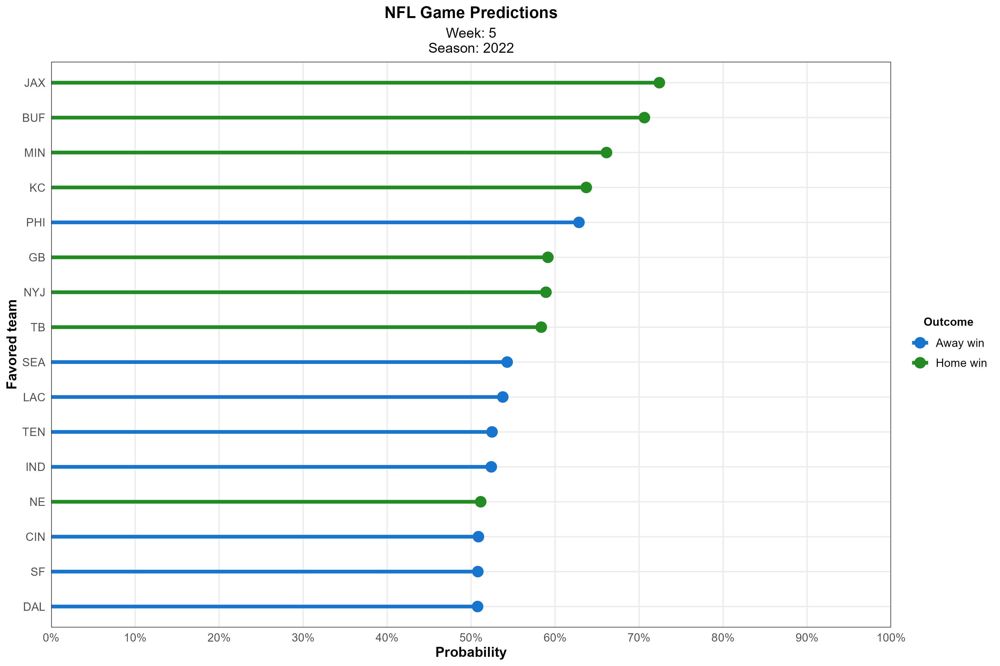

<!-- README.md is generated from README.Rmd. Please edit that file -->

# **nflpredictr** 

<!-- badges: start -->

[](#)
[](https://choosealicense.com/licenses/mit/)
<!-- badges: end -->

<div align="left">

<p align="left">
<a href="http://68.183.25.9:8000/__docs__/"><strong>« API »</strong></a>
<br /> <a href="https://anguswg-ucsb.github.io/nfl_wins/">Model
Details</a>
</p>

</div>

<hr>

The **`nflpredictr`** R package provides a lightweight R client for
retrieving predictions for upcoming (and past) NFL games via the [NFL
Win Predictor API](http://68.183.25.9:8000/__docs__/). Details on the
model used to make the predictions can be found
[here](https://anguswg-ucsb.github.io/nfl_wins/)

**`nflpredictr`** provides four main functionalities:

1.  Retrieves new data to use as the inputs into a [ML model trained to
    predict the outcomes of NFL
    games](https://anguswg-ucsb.github.io/nfl_wins/)
2.  Provide the new data to the [API](http://68.183.25.9:8000/__docs__/)
    and return predictions
3.  Visualize results.
4.  Retrieve Las Vegas Odds and lines to compare with the predictions
    generated from **`nflpredictr`**

<hr>

## Installation

You can install the development version of **`nflpredictr`** from
[GitHub](https://github.com/) with:

``` r
# install.packages("devtools")
devtools::install_github("anguswg-ucsb/nflpredictr")
```

## Example

**`nflpredictr`** provides utility functions for accessing game
predictions from a Logistic Regression ML model that was trained on \~20
years of historic NFL data and [correctly predicts the outcomes of games
\~69% of the
time](https://anguswg-ucsb.github.io/nfl_wins/#Model_Performance_on_Test_Data).
If no inputs are given to **`predict_games()`**, the default behavior is
to make a prediction for week 2 of the 2021 NFL season.

``` r
# Load package
library(nflpredictr)

# Make an API request using predict_games(), default week is the upcoming week of the season
nflpredictr::predict_games(
  year = 2021,
  week = 2
)
#> 
#> 
#> Sending request to nflwinpredictor API...
#> Request URL:
#> http://68.183.25.9:8000/predict-new-data?year=2021&pred_week=2
#> # A tibble: 16 × 8
#>    season  week game_id         home_team away_team win   home_win_prob away_w…¹
#>     <int> <int> <chr>           <chr>     <chr>     <chr>         <dbl>    <dbl>
#>  1   2021     2 2021_02_SF_PHI  PHI       SF        1             0.699    0.301
#>  2   2021     2 2021_02_TEN_SEA SEA       TEN       1             0.694    0.306
#>  3   2021     2 2021_02_MIN_ARI ARI       MIN       1             0.692    0.308
#>  4   2021     2 2021_02_ATL_TB  TB        ATL       1             0.644    0.356
#>  5   2021     2 2021_02_LV_PIT  PIT       LV        1             0.618    0.382
#>  6   2021     2 2021_02_DAL_LAC LAC       DAL       1             0.572    0.428
#>  7   2021     2 2021_02_BUF_MIA MIA       BUF       1             0.544    0.456
#>  8   2021     2 2021_02_KC_BAL  BAL       KC        1             0.540    0.460
#>  9   2021     2 2021_02_HOU_CLE CLE       HOU       1             0.509    0.491
#> 10   2021     2 2021_02_NYG_WAS WAS       NYG       0             0.498    0.502
#> 11   2021     2 2021_02_NO_CAR  CAR       NO        0             0.471    0.529
#> 12   2021     2 2021_02_NE_NYJ  NYJ       NE        0             0.449    0.551
#> 13   2021     2 2021_02_CIN_CHI CHI       CIN       0             0.443    0.557
#> 14   2021     2 2021_02_DEN_JAX JAX       DEN       0             0.417    0.583
#> 15   2021     2 2021_02_LA_IND  IND       LA        0             0.413    0.587
#> 16   2021     2 2021_02_DET_GB  GB        DET       0             0.312    0.688
#> # … with abbreviated variable name ¹​away_win_prob
```

<br>

## Make predictions on past games

Predictions can also be requested for weeks of past NFL seasons, going
as far back as the 2016 season.

``` r
# Make an API request using predict_games() for a specific year and week
nflpredictr::predict_games(
  year = 2018,
  week = 8
  )
#> 
#> 
#> Sending request to nflwinpredictor API...
#> Request URL:
#> http://68.183.25.9:8000/predict-new-data?year=2018&pred_week=8
#> # A tibble: 14 × 8
#>    season  week game_id         home_team away_team win   home_win_prob away_w…¹
#>     <int> <int> <chr>           <chr>     <chr>     <chr>         <dbl>    <dbl>
#>  1   2018     8 2018_08_GB_LA   LA        GB        1             0.758    0.242
#>  2   2018     8 2018_08_CLE_PIT PIT       CLE       1             0.729    0.271
#>  3   2018     8 2018_08_NYJ_CHI CHI       NYJ       1             0.683    0.317
#>  4   2018     8 2018_08_DEN_KC  KC        DEN       1             0.650    0.350
#>  5   2018     8 2018_08_MIA_HOU HOU       MIA       1             0.639    0.361
#>  6   2018     8 2018_08_SF_ARI  ARI       SF        1             0.563    0.437
#>  7   2018     8 2018_08_TB_CIN  CIN       TB        1             0.561    0.439
#>  8   2018     8 2018_08_BAL_CAR CAR       BAL       1             0.555    0.445
#>  9   2018     8 2018_08_SEA_DET DET       SEA       1             0.552    0.448
#> 10   2018     8 2018_08_NO_MIN  MIN       NO        1             0.524    0.476
#> 11   2018     8 2018_08_PHI_JAX JAX       PHI       0             0.440    0.560
#> 12   2018     8 2018_08_WAS_NYG NYG       WAS       0             0.406    0.594
#> 13   2018     8 2018_08_IND_LV  LV        IND       0             0.397    0.603
#> 14   2018     8 2018_08_NE_BUF  BUF       NE        0             0.317    0.683
#> # … with abbreviated variable name ¹​away_win_prob
```

## Make a tile plot of win probabilities

`nflpredictr` contains a few functions for quick plotting the outputs
from **`predict_games()`**. The **`plot_tile()`** function will plot
each match up side by side on a tile plot and color code teams by their
predicted win probability from the NFL Win Prediction API.

``` r
# Plot the outputs from predict_games()
tile_plot <- nflpredictr::plot_tile(
                  predictions = nflpredictr::predict_games(
                    year = 2021,
                    week = 5
                  )
              )
```


<br>

## Plot the teams favored to win that week

The `plot_favored()` function will plot the teams favored by the NFL Win
Prediction API model in order of win probability.

``` r
# Plot the outputs from predict_games()
fav_plot <- nflpredictr::plot_favored(
                predictions = nflpredictr::predict_games(
                                  year = 2021,
                                  week = 5
                                ),
                prob_alpha  = FALSE
                )
```



<br>
